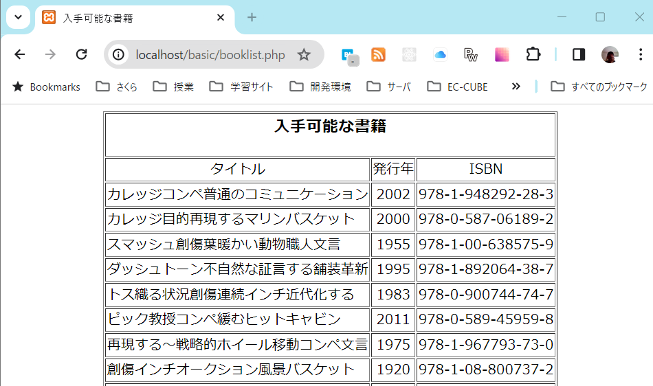

## PHPとは

### PHPの基本的な使用法

- サーバサイドのスクリプトとして
   - 動的なコンテンツを作成する
   - PHPパーサーとウェブサーバーが必要
   - データベース接続による動的なコンテンツの生成
   - XMLドキュメント、グラフィックス、PDFファイルの生成
 - コマンドラインのスクリプトとして
    - Perlやawk、Unixのシェルなどと同じ感覚
    - バックアップ、ログ管理などのシステム管理作業
    - cronジョブ(スケジューラ)で使うようなスクリプト(何も表示されないようなPHPスクリプト)

### PHPの例

#### 1. htmlに埋め込む(hello_world.php)

``` html
<html>
  <head>
    <title>Look Out World</title>
  </head>
  <body>
    <?php echo "Hello, world!"; ?>
  </body>
</html>
```


#### 2. phpinfo()の使用例 (phpinfo.php)

``` html
<?php phpinfo(); ?>
```


#### 3. フォームの処理(form.php)

``` html
<html>
  <head>
    <title>個人向けあいさつフォーム</title>
  </head>
  <body>
    <?php if(!empty($_POST['name'])) {
      echo "ようこそ、{$_POST['name']}さん";
    }?>

    <form action="<?php echo $_SERVER['PHP_SELF']; ?>" method="post">
      名前を入力してください：<input type="text" name="name" />
    </form>
  </body>
</html>
```


#### 4. 書籍データベースへの問い合わせ(booklist.php)

``` html
<?php
$db = new mysqli("localhost", "libuser", "password", "library");

// 上で指定した接続情報が正しいことを確認
if ($db->connect_error) {
  die("接続エラー ({$db->connect_errno}) {$db->connect_error}");
}

$sql = "SELECT * FROM books ORDER BY title";
$result = $db->query($sql);

?>
<html>
  <head>
    <title>入手可能な書籍</title>
  </head>
  <body>
    <table cellspacing="2" celPadding="6" align="center" border="1">
      <tr>
        <td colspan="4">
          <h3 align="center">入手可能な書籍</h3>
        </td>
        <tr>
          <td align="center">タイトル</td>
          <td align="center">発行年</td>
          <td align="center">ISBN</td>
        </tr>
        <?php while ($row = $result->fetch_assoc()) : ?>
        <tr>
          <td><?php echo stripslashes($row['title']); ?></td>
          <td align="center"><?php echo $row['pub_year']; ?></td>
          <td><?php echo $row['ISBN']; ?></td>

        </tr>
        <?php endwhile ?>
      </tr>
    </table>
  </body>
</html>
```



#### 5. 動的なボタン(graphic_example.php)

``` html

```
