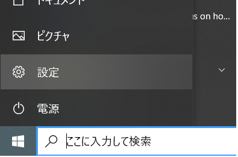
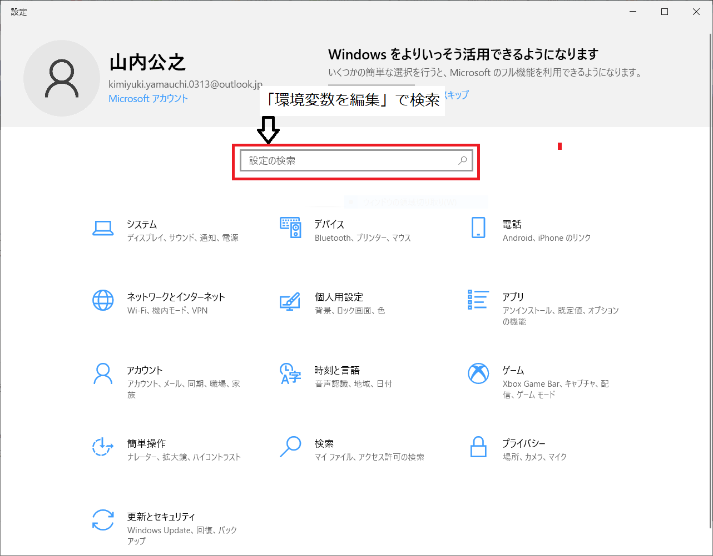
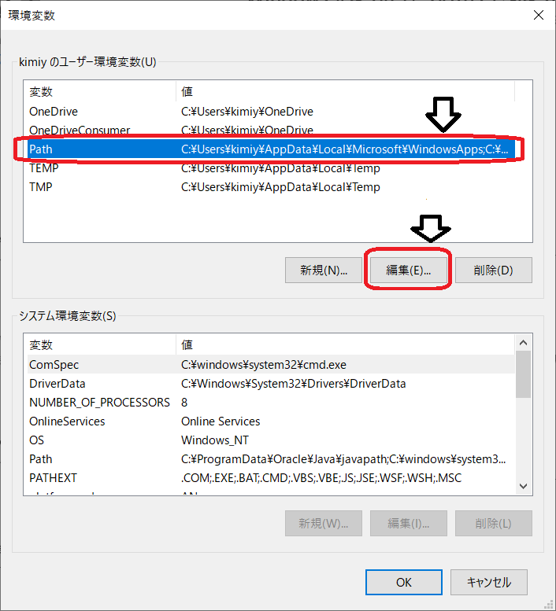
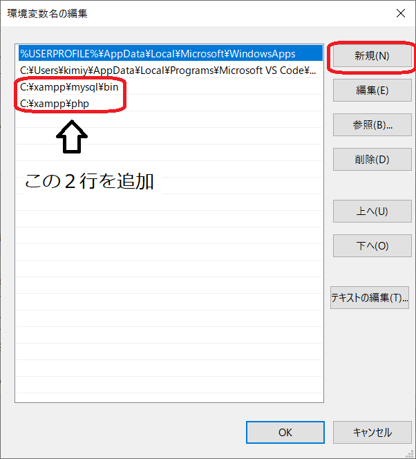

## 環境変数の編集

1. スタートの「設定」をクリック

<!--  -->

2. 「環境変数を編集」で検索

<!--  -->

3. 「ユーザ環境変数」の「Path」を選択し、「編集」をクリック

<!--  -->

<!-- 

 -->

4. 「新規」ボタンをクリックし、以下の2行を追加
   1. C:\xampp\mysql\bin
   2. C:\xampp\php

<!--  -->

以上です