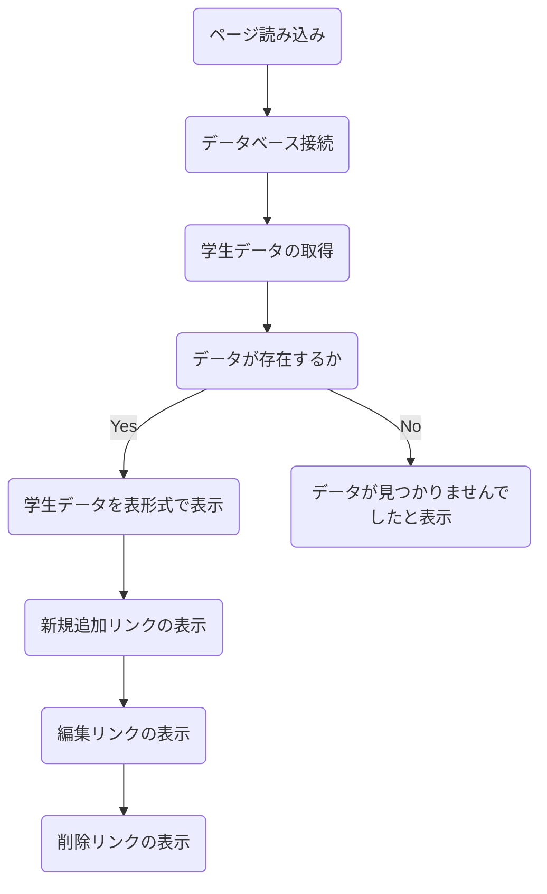
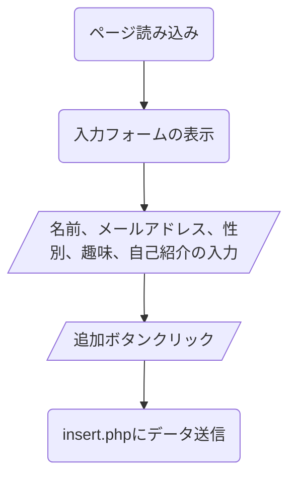
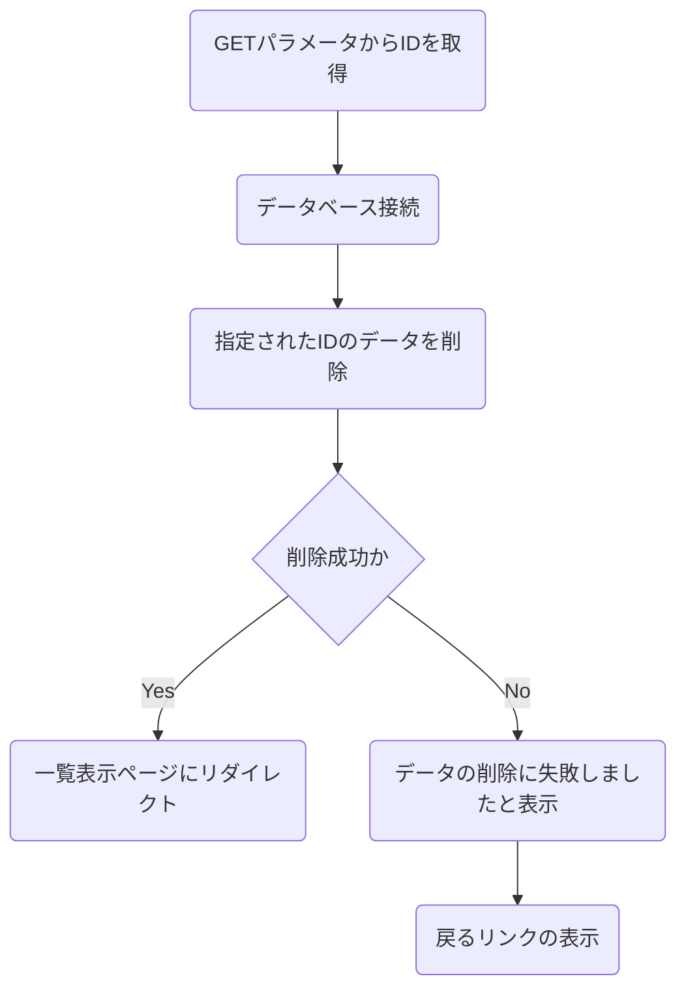
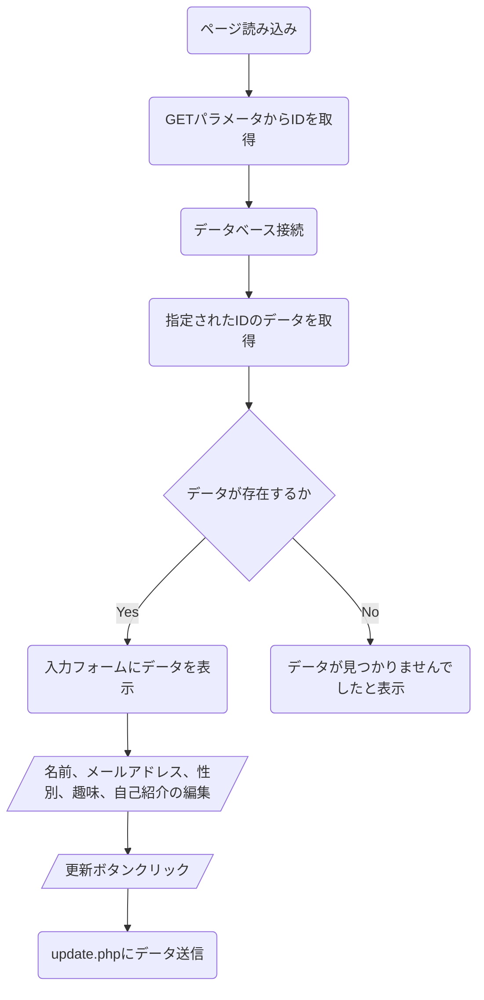
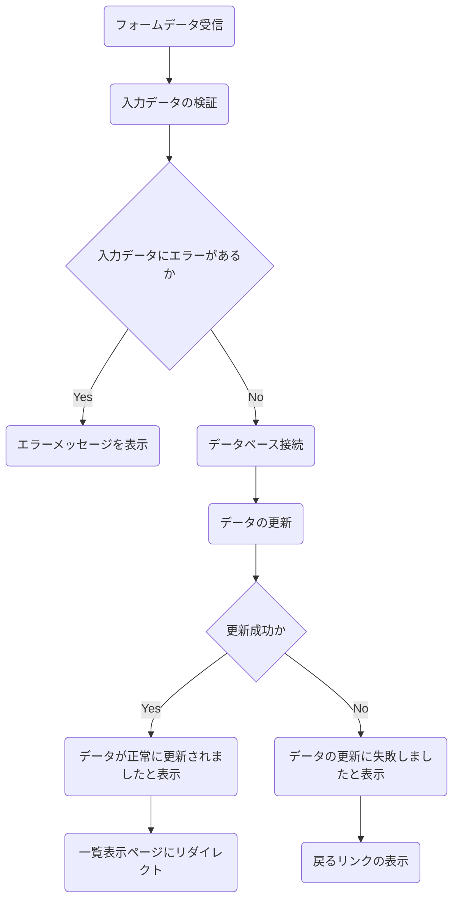

# Q7
students表のデータの一覧表示/追加/削除/更新を行うWebアプリを作成してください  

#### 追加/削除/更新が正常に行えた場合
一覧表示画面に戻る

#### 追加/削除/更新に失敗した場合
失敗した原因を表示する

### 実装方法

1. 以下をベースのソースを元にindex.php、add.php、insert.php、delete.php、edit.php、update.phpを作成する。  
それぞれのファイルの役割は以下とおり
   - **index.php:** 学生データの一覧を表示し、新規追加、編集、削除のリンクを追加。
   - **add.php:** 新しい学生データを追加するフォーム。
   - **insert.php:** フォームデータをデータベースに挿入し、完了後に`index.php`にリダイレクト。
   - **delete.php:** 指定されたIDの学生データをデータベースから削除し、完了後に`index.php`にリダイレクト。
   - **edit.php:** 既存の学生データを編集するフォーム。
   - **update.php:** フォームデータをデータベースで更新し、完了後にindex.phpにリダイレクト。

**index.php:**


**add.php:**


**insert.php:**


**delete.php:**


**edit.php:**


**update.php:**


2. 送られてきたデータのチェックを行う<br>
複数のエラーがある場合は箇条書きで列挙する
   1. 名前
      1. 空白の場合 =>「名前は必須項目です。」
   2. メールアドレス
      1. 空白の場合 =>「メールアドレスは必須項目です。」
      2. メールアドレスの形式の不正 => 「メールアドレスの形式が正しくありません。」
   3. 性別
      1. 性別を選択していない場合 => 「性別は必須項目です。」
      2. 男性/女性/その他以外の場合 => 「値が不正です（性別）」
   4. 趣味
      1. 趣味を一つも選択していな場合 => 「少なくとも一つの趣味を選択してください。」
      2. 読書/スポーツ/音楽/旅行以外の場合 =>「値が不正です（趣味）」

#### header.php
``` php
<!DOCTYPE html>
<html>
<head>
<meta charset="UTF-8">
<title>PHP Sample Programs</title>
</head>
<style>
table {
	border-collapse: collapse;
}
table, th, td {
	border: 1px solid black;
}
th, td {
	padding: 8px;
	text-aling: left;
}
th {
	background-color: #f2f2f2;
}
</style>
<body>
```

#### footer.php
``` php
</body>
</html>
```

#### index.php
``` php
<?php require './header.php'; ?>
<h2>学生データ一覧</h2>
<?php
// ここに一覧表示の処理を記述

?>
<?php require './footer.php'; ?>
```

#### editform.php
``` php
<?php require './header.php'; ?>

<h2>学生データ編集</h2>
<?php
if (!isset($_GET['id'])) {
    echo "<p>IDが指定されていません。</p>";
    exit;
}


<?php require './footer.php'; ?>
```

#### update.php
``` php
<?php require './header.php'; ?>

<h2>更新結果</h2>
<?php
if ($_SERVER["REQUEST_METHOD"] == "POST") {
	// 以下にデータの更新処理を記述


} else {
    echo "<p>フォームからデータが送信されていません。</p>";
}
?>
<p><a href="index.php">戻る</a></p>
<?php require './footer.php'; ?>
```
