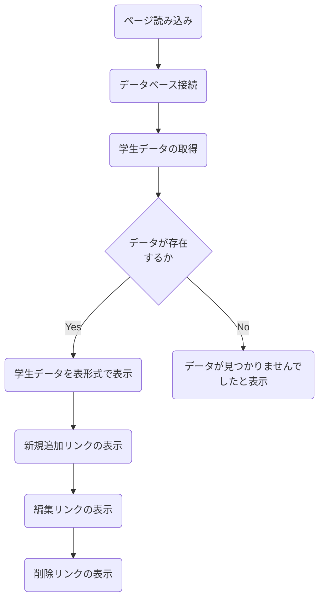
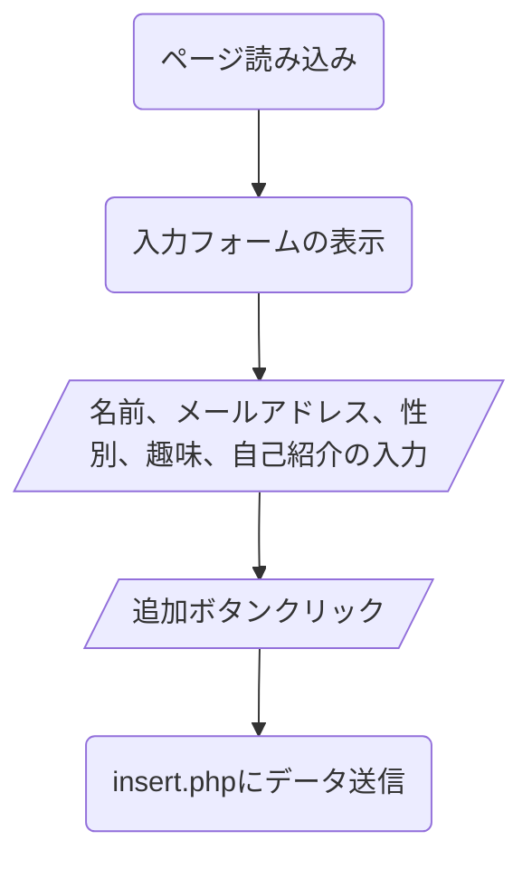
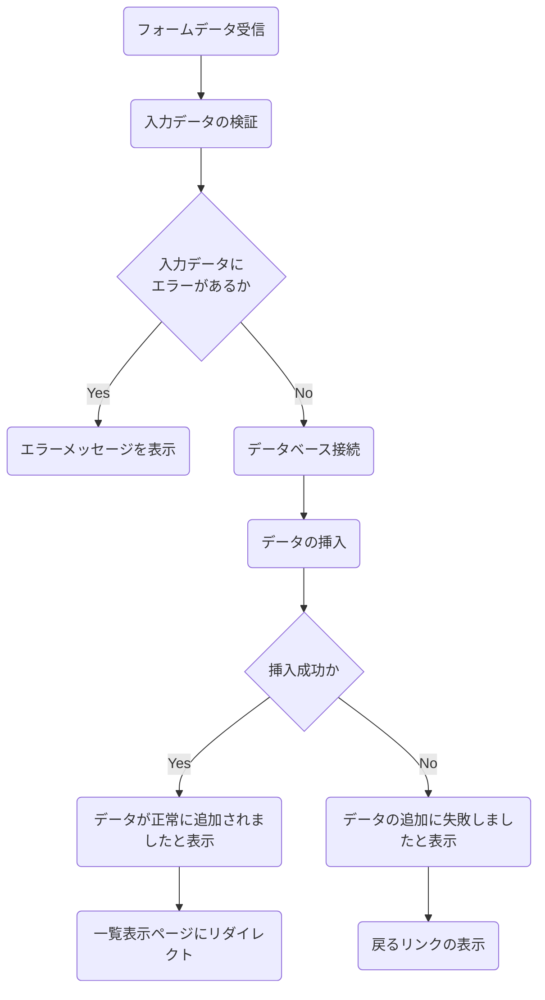
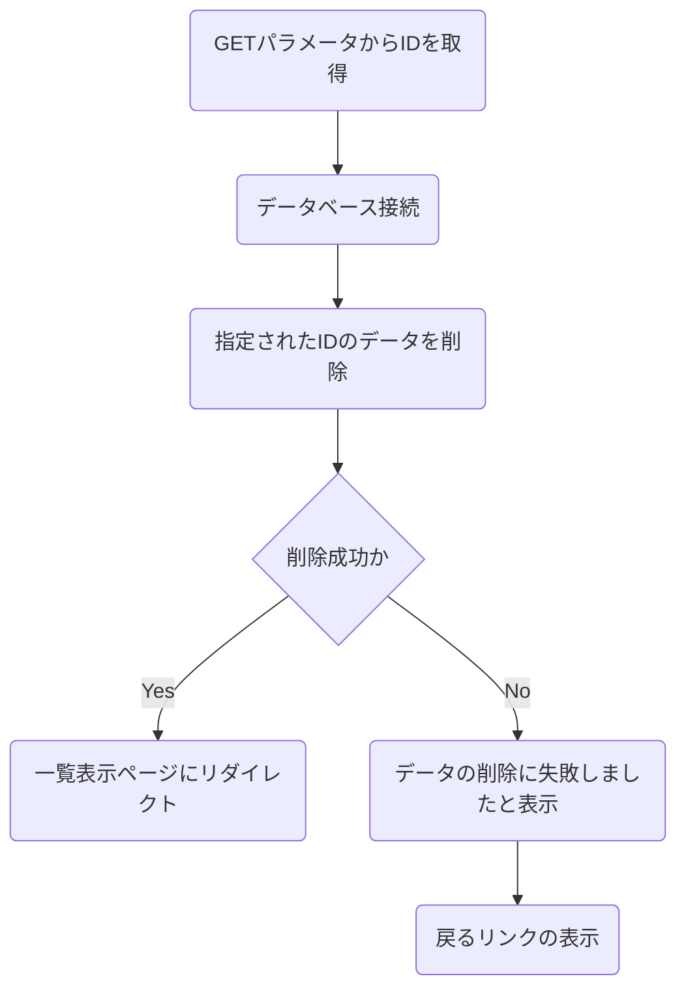
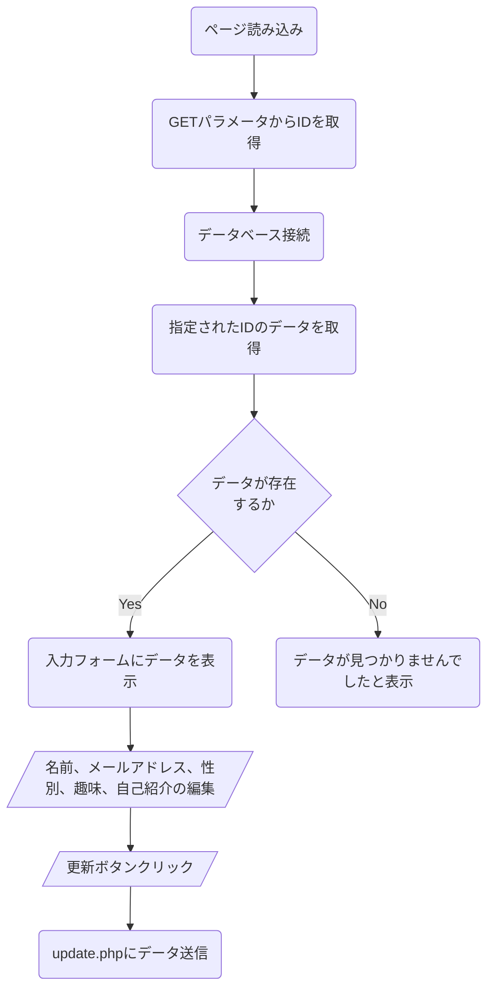
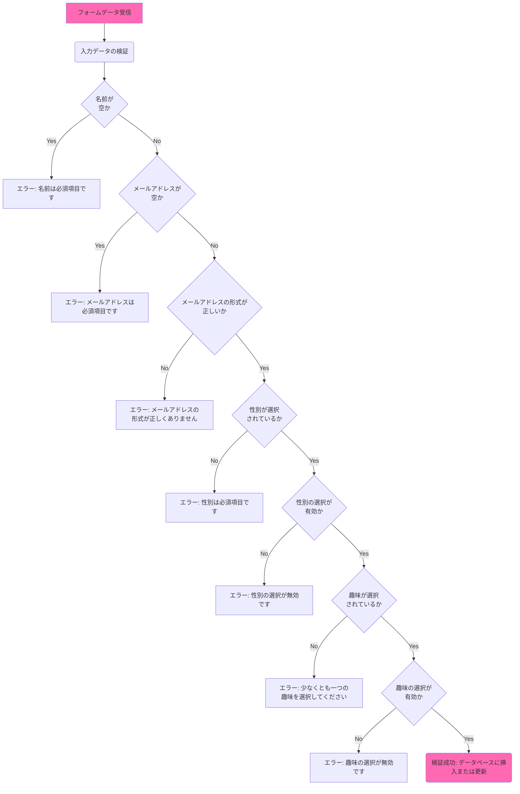

# Q7
students表のデータの一覧表示/追加/削除/更新を行うWebアプリを作成してください  

#### 追加/削除/更新が正常に行えた場合
一覧表示画面に戻る

#### 追加/削除/更新に失敗した場合
失敗した原因を表示する

### 実装方法

1. 以下をベースのソースを元にindex.php、add.php、insert.php、delete.php、edit.php、update.phpを作成する。  
それぞれのファイルの役割は以下とおり
   - **index.php:** 学生データの一覧を表示し、新規追加、編集、削除のリンクを追加。
   - **add.php:** 新しい学生データを追加するフォーム。
   - **insert.php:** フォームデータをデータベースに挿入し、完了後に`index.php`にリダイレクト。
   - **delete.php:** 指定されたIDの学生データをデータベースから削除し、完了後に`index.php`にリダイレクト。
   - **edit.php:** 既存の学生データを編集するフォーム。
   - **update.php:** フォームデータをデータベースで更新し、完了後にindex.phpにリダイレクト。

#### index.php


#### add.php


#### insert.php


#### delete.php


#### edit.php


#### update.php


#### 入力データの検証



#### index.php
``` php
<!DOCTYPE html>
<html lang="ja">
<head>
    <meta charset="UTF-8">
    <title>学生データ一覧</title>
    <style>
        table {
            width: 100%;
            border-collapse: collapse;
        }
        table, th, td {
            border: 1px solid black;
        }
        th, td {
            padding: 8px;
            text-align: left;
        }
        th {
            background-color: #f2f2f2;
        }
    </style>
</head>
<body>
    <h2>学生データ一覧</h2>
    <p><a href="add.php">新規追加</a></p>
    <?php
    // PDOでのデータベース接続設定
    $dsn = 'mysql:host=localhost;dbname=q02;charset=utf8';
    $username = 'admin';
    $password = 'q02';

    try {
        $pdo = new PDO($dsn, $username, $password);
        $pdo->setAttribute(PDO::ATTR_ERRMODE, PDO::ERRMODE_EXCEPTION);

      // ここに一覧表示の処理を記述


    } catch (PDOException $e) {
        echo "接続に失敗しました: " . $e->getMessage();
    }
    ?>
</body>
</html>
```

#### add.php
``` php
<!DOCTYPE html>
<html lang="ja">
<head>
    <meta charset="UTF-8">
    <title>学生データ追加</title>
</head>
<body>
    <h2>学生データ追加</h2>
    <form action="insert.php" method="post">
        <label for="name">名前:</label><br>
        <input type="text" id="name" name="name" required><br><br>

        <label for="email">メールアドレス:</label><br>
        <input type="email" id="email" name="email" required><br><br>

        <label>性別:</label><br>
        <input type="radio" id="male" name="gender" value="男性" required>
        <label for="male">男性</label><br>
        <input type="radio" id="female" name="gender" value="女性">
        <label for="female">女性</label><br>
        <input type="radio" id="other" name="gender" value="その他">
        <label for="other">その他</label><br><br>

        <label>趣味:</label><br>
        <input type="checkbox" id="reading" name="hobbies[]" value="読書">
        <label for="reading">読書</label><br>
        <input type="checkbox" id="sports" name="hobbies[]" value="スポーツ">
        <label for="sports">スポーツ</label><br>
        <input type="checkbox" id="music" name="hobbies[]" value="音楽">
        <label for="music">音楽</label><br>
        <input type="checkbox" id="travel" name="hobbies[]" value="旅行">
        <label for="travel">旅行</label><br><br>

        <label for="introduction">自己紹介:</label><br>
        <textarea id="introduction" name="introduction" rows="4" cols="50"></textarea><br><br>

        <input type="submit" value="追加">
    </form>
</body>
</html>
```

#### insert.php
``` php
<!DOCTYPE html>
<html lang="ja">
<head>
    <meta charset="UTF-8">
    <title>追加結果</title>
</head>
<body>
    <h2>追加結果</h2>
<?php
if ($_SERVER["REQUEST_METHOD"] == "POST") {

   // ここに追加の処理を記述

} else {
   echo "<p>フォームからデータが送信されていません。</p>";
}
?>
    <p><a href="index.php">戻る</a></p>
</body>
</html>
```
